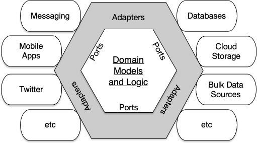

# Design

The project design was based on the Hexagonal Architecture, also known as Ports and Adapters Architecture. A visual representation is provided down below:

As shown in the image, the main goal of this architecture is to isolate domain models and logic from external adapters, providing ports (interfaces) that are used to achieve the Dependency Inversion Principle and help build more maintainable, extensible, and testable software.

The code of this project was split into folders with selfexplanatory names according to this architecture as follows:

## Domain

Contains the project entities, the core logic and business rules of the system. In this case there are only shallow enities (Movie and Quote), represented by interfaces. It was enough for the complexity of the API provided by now.

## Ports

This folder has the adapters' interfaces that are used throughout the project. Depending on these protocols makes tha application more flexible to change and easier to test.

## Adapters

Here are the implementations of the ports mentioned earlier. These adapters interact with the domain and with each other to provide the desired functionality of the code.

## Main

This layer is not represented in the architecture diagram, but it only has some factories to help compose the repositories in a simpler way. In this project's case it only creates the repositories with functions that require the API token.

## Utils

Also not in the diagram, this folder has utility functions that help some parts of the code.

# Tests

The code has a tests folder at the root. This folder contains all unit and integration tests of the application. It uses Jest to do it and make sure that everything works fine.

To run the project tests, add the TOKEN environment variable. It can be done creating a file called ".env" at the root of the project. Then it just requires the API token to be provided from the same website shown in the README.md file.